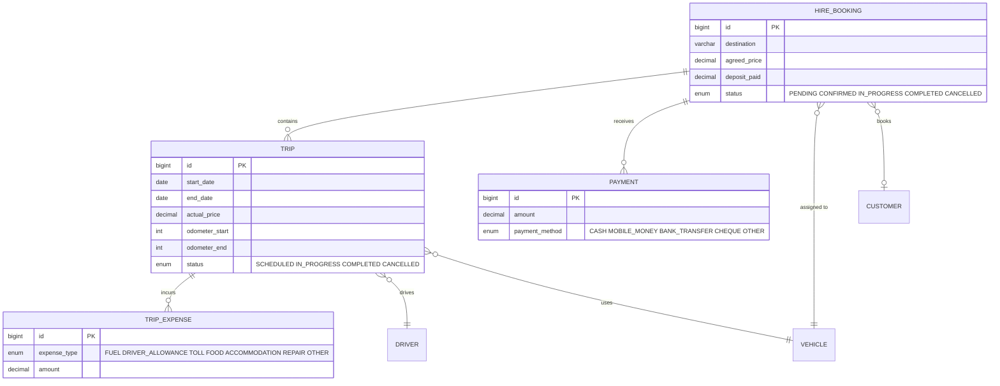
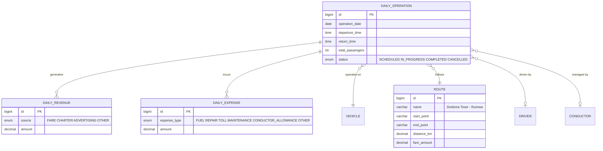
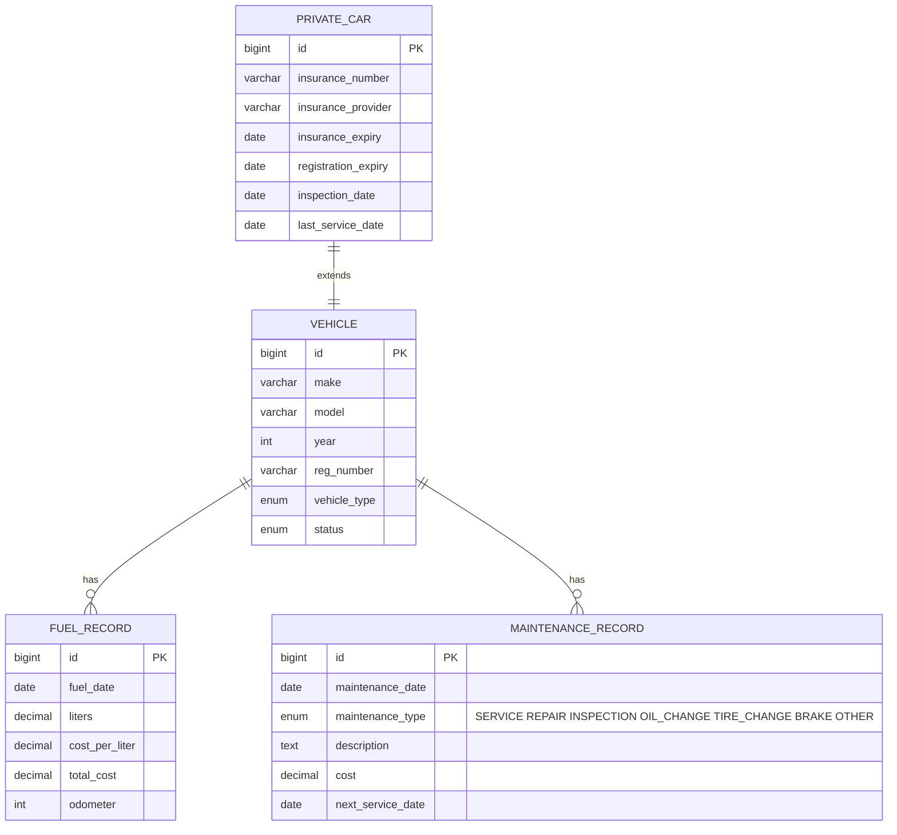
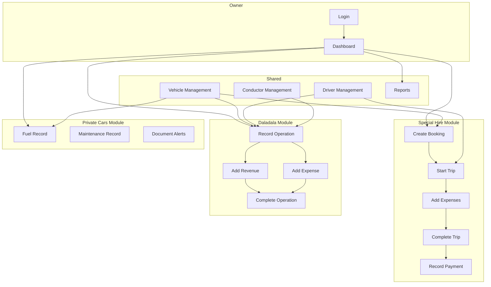

# MAMA MPOKI CAR HIRE — Entity Relationship Diagram

## Full ER Diagram (Mermaid)

```mermaid
erDiagram
    OWNER {
        bigint id PK
        varchar username UK
        varchar password
        varchar full_name
        varchar phone
        varchar email
        timestamp created_at
        timestamp updated_at
    }

    VEHICLE {
        bigint id PK
        bigint owner_id FK
        enum vehicle_type
        enum module_type
        varchar make
        varchar model
        int year
        varchar reg_number UK
        varchar color
        int capacity
        enum fuel_type
        enum status
        varchar photo_url
        text notes
        boolean deleted
        timestamp deleted_at
        timestamp created_at
        timestamp updated_at
    }

    DRIVER {
        bigint id PK
        bigint owner_id FK
        varchar full_name
        varchar phone
        varchar license_number
        date license_expiry
        varchar national_id
        varchar address
        decimal daily_rate
        enum status
        text notes
        boolean deleted
        timestamp deleted_at
        timestamp created_at
        timestamp updated_at
    }

    CONDUCTOR {
        bigint id PK
        bigint owner_id FK
        varchar full_name
        varchar phone
        varchar national_id
        varchar address
        decimal daily_rate
        enum status
        text notes
        boolean deleted
        timestamp deleted_at
        timestamp created_at
        timestamp updated_at
    }

    CUSTOMER {
        bigint id PK
        bigint owner_id FK
        varchar full_name
        varchar phone
        varchar email
        varchar address
        enum id_type
        varchar id_number
        text notes
        boolean deleted
        timestamp deleted_at
        timestamp created_at
        timestamp updated_at
    }

    HIRE_BOOKING {
        bigint id PK
        bigint owner_id FK
        bigint vehicle_id FK
        bigint customer_id FK
        date hire_date
        date end_date
        varchar destination
        varchar trip_purpose
        decimal agreed_price
        decimal deposit_paid
        enum status
        text notes
        boolean deleted
        timestamp deleted_at
        timestamp created_at
        timestamp updated_at
    }

    TRIP {
        bigint id PK
        bigint booking_id FK
        bigint driver_id FK
        bigint vehicle_id FK
        date start_date
        date end_date
        varchar destination
        decimal actual_price
        int odometer_start
        int odometer_end
        enum status
        text notes
        boolean deleted
        timestamp deleted_at
        timestamp created_at
        timestamp updated_at
    }

    TRIP_EXPENSE {
        bigint id PK
        bigint trip_id FK
        enum expense_type
        decimal amount
        varchar description
        date expense_date
        boolean deleted
        timestamp deleted_at
        timestamp created_at
        timestamp updated_at
    }

    PAYMENT {
        bigint id PK
        bigint booking_id FK
        decimal amount
        enum payment_method
        date payment_date
        varchar reference_number
        text notes
        boolean deleted
        timestamp deleted_at
        timestamp created_at
        timestamp updated_at
    }

    ROUTE {
        bigint id PK
        bigint owner_id FK
        varchar name
        varchar start_point
        varchar end_point
        decimal distance_km
        decimal fare_amount
        enum status
        text notes
        boolean deleted
        timestamp deleted_at
        timestamp created_at
        timestamp updated_at
    }

    DAILY_OPERATION {
        bigint id PK
        bigint vehicle_id FK
        bigint route_id FK
        bigint driver_id FK
        bigint conductor_id FK
        date operation_date
        time departure_time
        time return_time
        int total_passengers
        enum status
        text notes
        boolean deleted
        timestamp deleted_at
        timestamp created_at
        timestamp updated_at
    }

    DAILY_REVENUE {
        bigint id PK
        bigint operation_id FK
        enum source
        decimal amount
        varchar description
        date revenue_date
        boolean deleted
        timestamp deleted_at
        timestamp created_at
        timestamp updated_at
    }

    DAILY_EXPENSE {
        bigint id PK
        bigint operation_id FK
        enum expense_type
        decimal amount
        varchar description
        date expense_date
        boolean deleted
        timestamp deleted_at
        timestamp created_at
        timestamp updated_at
    }

    FUEL_RECORD {
        bigint id PK
        bigint vehicle_id FK
        date fuel_date
        decimal liters
        decimal cost_per_liter
        decimal total_cost
        int odometer
        varchar station
        text notes
        boolean deleted
        timestamp deleted_at
        timestamp created_at
        timestamp updated_at
    }

    MAINTENANCE_RECORD {
        bigint id PK
        bigint vehicle_id FK
        date maintenance_date
        enum maintenance_type
        text description
        decimal cost
        varchar garage_name
        int odometer
        date next_service_date
        text notes
        boolean deleted
        timestamp deleted_at
        timestamp created_at
        timestamp updated_at
    }

    PRIVATE_CAR {
        bigint id PK
        bigint vehicle_id FK UK
        varchar insurance_number
        varchar insurance_provider
        date insurance_expiry
        date registration_expiry
        date inspection_date
        date last_service_date
        int annual_mileage
        text notes
        boolean deleted
        timestamp deleted_at
        timestamp created_at
        timestamp updated_at
    }

    %% ===== RELATIONSHIPS =====

    OWNER ||--o{ VEHICLE : "manages"
    OWNER ||--o{ DRIVER : "employs"
    OWNER ||--o{ CONDUCTOR : "employs"
    OWNER ||--o{ CUSTOMER : "records"
    OWNER ||--o{ HIRE_BOOKING : "creates"
    OWNER ||--o{ ROUTE : "defines"

    VEHICLE ||--o{ FUEL_RECORD : "has"
    VEHICLE ||--o{ MAINTENANCE_RECORD : "has"
    VEHICLE ||--o| PRIVATE_CAR : "extends (private only)"
    VEHICLE ||--o{ HIRE_BOOKING : "assigned to"
    VEHICLE ||--o{ TRIP : "used in"
    VEHICLE ||--o{ DAILY_OPERATION : "operated on"

    DRIVER ||--o{ TRIP : "drives"
    DRIVER ||--o{ DAILY_OPERATION : "drives"
    CONDUCTOR ||--o{ DAILY_OPERATION : "manages fares"

    CUSTOMER ||--o{ HIRE_BOOKING : "books"

    HIRE_BOOKING ||--o{ TRIP : "contains"
    HIRE_BOOKING ||--o{ PAYMENT : "receives"

    TRIP ||--o{ TRIP_EXPENSE : "incurs"

    ROUTE ||--o{ DAILY_OPERATION : "followed on"

    DAILY_OPERATION ||--o{ DAILY_REVENUE : "generates"
    DAILY_OPERATION ||--o{ DAILY_EXPENSE : "incurs"
```

## Module-Based View

### Special Hire Module



### Daladala Module



### Private Cars Module



## Enums Reference

```mermaid
classDiagram
    class VehicleType {
        <<enumeration>>
        COASTER
        MINIBUS
        DALADALA_BUS
        PRIVATE_CAR
        OTHER
    }

    class ModuleType {
        <<enumeration>>
        SPECIAL_HIRE
        DALADALA
        PRIVATE
    }

    class VehicleStatus {
        <<enumeration>>
        ACTIVE
        INACTIVE
        MAINTENANCE
        RETIRED
    }

    class FuelType {
        <<enumeration>>
        DIESEL
        PETROL
        CNG
        ELECTRIC
    }

    class BookingStatus {
        <<enumeration>>
        PENDING
        CONFIRMED
        IN_PROGRESS
        COMPLETED
        CANCELLED
    }

    class TripStatus {
        <<enumeration>>
        SCHEDULED
        IN_PROGRESS
        COMPLETED
        CANCELLED
    }

    class TripExpenseType {
        <<enumeration>>
        FUEL
        DRIVER_ALLOWANCE
        TOLL
        FOOD
        ACCOMMODATION
        REPAIR
        OTHER
    }

    class PaymentMethod {
        <<enumeration>>
        CASH
        MOBILE_MONEY
        BANK_TRANSFER
        CHEQUE
        OTHER
    }

    class DailyRevenueSource {
        <<enumeration>>
        FARE
        CHARTER
        ADVERTISING
        OTHER
    }

    class DailyExpenseType {
        <<enumeration>>
        FUEL
        REPAIR
        TOLL
        MAINTENANCE
        CONDUCTOR_ALLOWANCE
        OTHER
    }

    class MaintenanceType {
        <<enumeration>>
        SERVICE
        REPAIR
        INSPECTION
        OIL_CHANGE
        TIRE_CHANGE
        BRAKE
        OTHER
    }

    class CustomerIdType {
        <<enumeration>>
        NATIONAL_ID
        PASSPORT
        DRIVING_LICENSE
        OTHER
    }

    class StaffStatus {
        <<enumeration>>
        ACTIVE
        INACTIVE
        ON_LEAVE
    }
```



## Data Flow Diagram



## How to Render

### Option 1: GitHub/GitLab
Copy the mermaid code blocks into a `.md` file — GitHub and GitLab render Mermaid automatically.

### Option 2: VS Code
Install the "Markdown Preview Mermaid Support" extension, then preview the `.md` file.

### Option 3: Online
Paste the Mermaid code into [mermaid.live](https://mermaid.live) for instant rendering.

### Option 4: PlantUML (Alternative)
If you prefer PlantUML, let me know and I can convert the diagrams.
